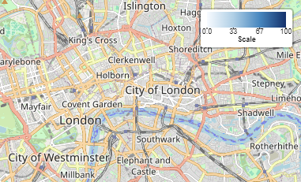

# Leaflet d3 Color Legend

A leaflet plugin that extends `L.Control` and adds a color legend to the map.

## Example

```
var map = L.map('map');

var cScale = d3.scaleSequential([0, 100], d3.interpolateBlues);

var legend = new L.Control.ColorLegend({
    position: "topright",
    colorScale: cScale,
    label: "Scale"
  });
  legend.addTo(map);
```



## Options

| Option | Type | Default | Description |
|--------|------|---------|-------------|
| position | String | 'topright' | Inherited from `L.Control` |
| colorScale | d3.scaleSequential | - | The colorScale from d3. Currently, only continuous scales generated with `scaleSequential` are supported. | 