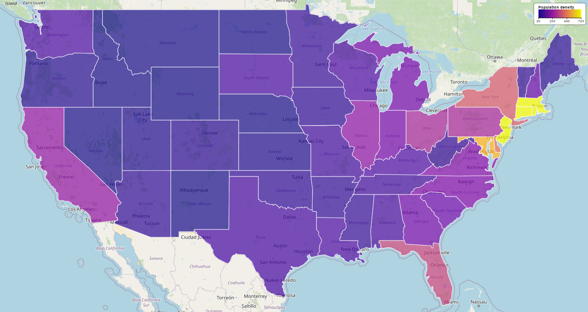
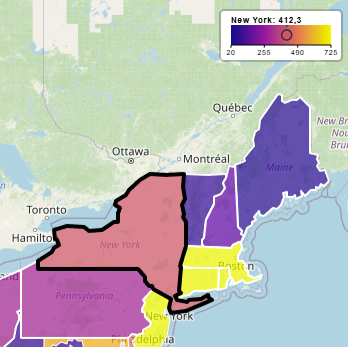

# Leaflet d3 Color Legend

A leaflet plugin that extends `L.Control` and adds a color legend to the map. Supports various scale types for univariate numeric data.


The legend is initialized either with data (array of numbers) or an existing d3 scale, and can be customized using additional options.

```
import { LeafletLegend  } from "leaflet-d3-color-legend"
var map = L.map('map');

const data = d3.range(0, 101, 10)

// data cann be passed directly as input
const legend = new LeafletLegend(data, {
    position: "topright",
    label: "Colorscale"
  });

// if a d3 scale already exists, it can also be passed
const scale = d3.scaleLinear().domain(d3.extent(data)).range(["#f7fbff", "#08306b"])
const legend = new LeafletLegend(scale, {
    position: "topright",
    label: "Colorscale"
  });

legend.addTo(map);
```

The legend can further indicate a specific value (e.g. when hoverving/clicking a geometry on the map). Passing null resets the legend and removes the indicator

```

const hoverInfo = {
  val: 55, label: "Name"
}
legend.setValue(hoverInfo)

```

## Example

Plotting the Population distribution of US states:

```
const map = L.map("map").setView([37.8, -96], 4);

L.tileLayer("https://{s}.tile.openstreetmap.org/{z}/{x}/{y}.png", {
  attribution: '&copy; OpenStreetMap contributors'
}).addTo(map);

// Fetch US states GeoJSON
fetch("https://raw.githubusercontent.com/PublicaMundi/MappingAPI/master/data/geojson/us-states.json")
  .then(res => res.json())
  .then(data => {
    // Color based on a simple numeric property
    const values = data.features.map((d: any) => d.properties.density || 0);
    const colorScale = d3.scaleSequential()
      .interpolator(d3.interpolatePlasma)
      .domain([d3.quantile(values, 0.1), d3.quantile(values, 0.9)] as [number, number])
      .clamp(true);

    L.geoJSON(data, {
      style: (feature: any) => ({
        fillColor: colorScale(feature.properties.density),
        weight: 1,
        opacity: 1,
        color: "white",
        fillOpacity: 0.7
      }),
      onEachFeature: (feature, layer) => {
        layer.on("mouseover", () => {
          legend.setValue({ val: feature.properties.density, label: feature.properties.name });
          layer.setStyle({color: "black", weight: 4 });
          layer.bringToFront();
        });
        layer.on("mouseout", () => {
          legend.setValue(null);
          layer.setStyle({ color: "white", weight: 2 });
        });
      }
    }).addTo(map);

    const legend = new LeafletLegend(colorScale, {
      position: "topright",
      label: "Population density"
    });
    legend.addTo(map);
  });
```






## Options

| Option | Type | Default | Description |
|--------|------|---------|-------------|
| position | String | 'topright' | Inherited from `L.Control` |
| interpolator | (t: number) => string | [interpolatePlasma](https://d3js.org/d3-scale-chromatic/sequential#interpolatePlasma) | Interpolator used for the colorscale from [d3 Sequential Schemes](https://d3js.org/d3-scale-chromatic/sequential) |
| nTicks | number | 4 | How many ticks shall be drawn |
| label | String | '' | A label that is placed under the colormap |
| width | number | 100 | width of the legend |
| width | number | 40 | width of the legend |